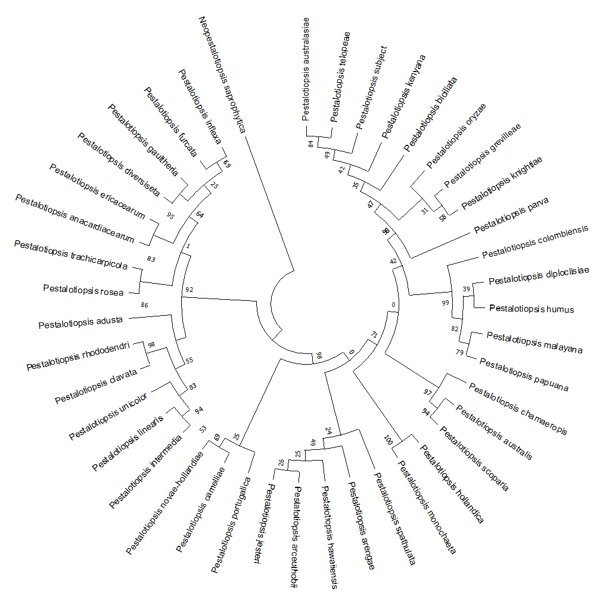

## Phylogenetic Analysis

The following contains the steps used in compiling accessions, generating multisequence alignments, concatenation, tree building and visualization.

### Sequence Acquisition
A list of type sequences containing ITS, TUB, and TEF accessions for _Pestalotiopsis_, including an outgroup using the species _Neopestalotiopsis saprophytica_, was constructed from prior work.[^1]

[accessions.csv](accessions.csv) was created with the compiled list of accessions. The list was curated by removing any repeat species and species outside of the target genus.

#### Retreiving Gene Sequences from Subject Genome
ITS, TUB, and TEF regions of the subject Pestalotiopsis genome was obtained using [seqkit](https://bioinf.shenwei.me/seqkit/) `v2.0.0` using the following command supplied with [primers.tsv](primers.tsv) containing primers targetting the regions of interest: 

```zsh
cat consensus.fasta | seqkit amplicon -j 16 -m 2 -p primers.tsv --bed
```

The outputs of each were saved as individual fasta files:
* [subject_its.fasta](files/subject_its.fasta)
* [subject_tub.fasta](files/subject_tub.fasta)
* [subject_tef.fasta](files/subject_tef.fasta)

#### Sequence Compilation
A [utility script](accession_downloader.py) was made to download the accessions in the source CSV from NCBI GenBank using [BioPython](https://biopython.org/) and compile them into three seperate loci-specific fasta files.

The utility also appends the subject genome loci-specific files to the corresponding list of accession sequences downloaded by the script.

The utility requires an email address as a single argument as required by the Entrez API.

```bash
 python accession_downloader.py email@domain.com
 ```

 The resulting files generated containing all of the accessions used in the phylogenic analysis, including sequences from the outgroup and subject genome are as follows:

* [its_combined.fasta](files/its_combined.fasta)
* [tub_combined.fasta](files/tub_combined.fasta)
* [tef_combined.fasta](files/tef_combined.fasta)

### Sequence Alignment
All three sequences were aligned using [MAFFT](https://mafft.cbrc.jp/alignment/software/) `v7.453` using the `--auto` settings.

```zsh
mafft --auto files/its_combined.fasta > its_aligned.fasta
mafft --auto files/tub_combined.fasta > tub_aligned.fasta
mafft --auto files/tef_combined.fasta > tef_aligned.fasta
```

The alignments were then trimmed and concatenated using [Mega 11](https://www.megasoftware.net/dload_mac_beta). 

### Tree Building
A Maximum Likelihood (ML) tree was constructed in [Mega 11](https://www.megasoftware.net/) using the combined ITS+TUB+TEF alignment with default settings and 100 bootstrap replications. 

The final tree was saved in Newick format: [final_tree.nwk](final_tree.nwk) 

### Visualization

<a href="images/tree.png"></a>
<a href="images/circle.png"></a>
<a href="images/curved.png"></a>

[^1]: Maharachchikumbura SS, Hyde KD, Groenewald JZ, Xu J, Crous PW. Pestalotiopsis revisited. Stud Mycol. 2014 Sep;79:121-86. doi: 10.1016/j.simyco.2014.09.005. PMID: 25492988; PMCID: PMC4255583.